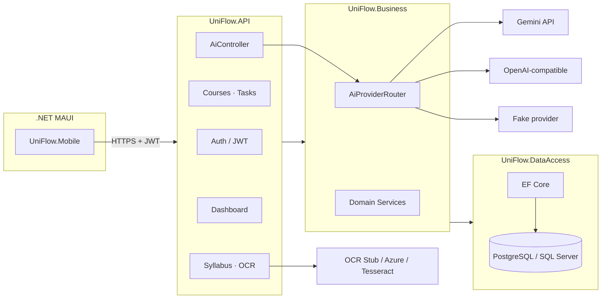

# UniFlow (AppPreneur)

**Üniversite öğrencileri için AI destekli akademik planlama** — müfredat tarama, günlük odak (Big 3), ders/görev yönetimi ve kişiselleştirilmiş dashboard mesajları.

| | |
| --- | --- |
| **Backend** | ASP.NET Core 8 · EF Core 8 |
| **Mobile** | .NET MAUI (`net8.0-android`) |
| **Veritabanı** | PostgreSQL (Docker) · SQL Server LocalDB (dev fallback) |
| **AI** | Gemini · OpenAI-compatible (OpenRouter, Groq) · Fake (dev/test) |
| **Testler** | 116 otomatik test |

---

## İçindekiler

- [Özellikler](#özellikler)
- [Mimari](#mimari)
- [Gereksinimler](#gereksinimler)
- [Hızlı başlangıç](#hızlı-başlangıç)
- [Mobile uygulama](#mobile-uygulama)
- [Demo akışı](#demo-akışı-sunum--teslim)
- [Yapılandırma](#yapılandırma)
- [AI provider kurulumu](#ai-provider-kurulumu)
- [API özeti](#api-özeti)
- [Testler](#testler)
- [Güvenlik](#güvenlik)
- [PostgreSQL migration notu](#postgresql-migration-notu)
- [Proje yapısı](#proje-yapısı)
- [Dokümantasyon](#dokümantasyon)

---

## Özellikler

### Kimlik ve profil
- JWT ile kayıt / giriş
- Onboarding: görünen ad, bölüm, hedefler, kişilik tonu
- Profil görüntüleme ve güncelleme

### Akademik içerik
- **Müfredat:** PDF/görüntü tara → önizle → onayla → ders + görevler oluşur
- **Dersler:** tam CRUD
- **Görevler:** tam CRUD, bugün / yaklaşan / tümü listesi, durum (Bekliyor · Tamamlandı · Kaçırıldı)

### Dashboard ve AI
- **Bugün:** Big 3, istatistikler, kişiselleştirilmiş günlük mesaj
- **Haftalık özet:** otomatik yükleme + yenile
- **Çalışma planı:** AI ile N günlük plan
- **Görev geri bildirimi:** durum değişiminden sonra AI dialog
- **Sohbet:** kişilik tonlu AI chat

### Mobile ekranlar

| Tab | Ekran | Açıklama |
| --- | --- | --- |
| Bugün | Dashboard | Big 3, haftalık özet, çalışma planı |
| Görevler | Tasks | Filtreli tam görev listesi |
| Dersler | Courses | Ders CRUD |
| Sohbet | Chat | AI sohbet |
| Müfredat | Syllabus | Tarama ve onay |

---

## Mimari



**Katmanlar**

| Katman | Proje | Sorumluluk |
| --- | --- | --- |
| API | `UniFlow.API` | HTTP, auth, rate limit, health |
| Business | `UniFlow.Business` | Domain logic, AI, OCR, validation |
| Data | `UniFlow.DataAccess` | EF Core, queries, migrations |
| Entity | `UniFlow.Entity` | Modeller, result tipleri |
| Mobile | `UniFlow.Mobile` | MAUI UI, ApiClient |

---

## Gereksinimler

| Araç | Sürüm | Not |
| --- | --- | --- |
| [.NET SDK](https://dotnet.microsoft.com/download) | 8.x | Backend + mobile build |
| [Docker Desktop](https://www.docker.com/products/docker-desktop/) | Güncel | PostgreSQL + API (önerilen) |
| Visual Studio 2022 | 17.8+ | MAUI + Android emulator |
| SQL Server LocalDB | — | Windows `dotnet run` fallback |

---

## Hızlı başlangıç

### Seçenek A — Docker (önerilen)

PostgreSQL + API tek komutla. [Docker Desktop](https://www.docker.com/products/docker-desktop/) açık olmalı.

```powershell
# 1. Ortam dosyası
cd c:\Users\enesy\Desktop\AppPreneur   # proje kökü
Copy-Item .env.example .env
# .env içinde JWT_KEY en az 32 karakter olsun

# 2. Doğrula ve başlat
docker compose config
docker compose up --build

# 3. Sağlık kontrolü
curl http://localhost:5000/health
```

| Endpoint | URL |
| --- | --- |
| API | `http://localhost:5000` |
| Swagger | `http://localhost:5000/swagger` |
| Health | `http://localhost:5000/health` |
| PostgreSQL | `localhost:5432` |

Development ortamında migration'lar API startup'ta **otomatik** uygulanır.

---

### Seçenek B — Local `dotnet run` (SQL Server LocalDB)

Docker olmadan en hızlı demo. AI için `Fake` provider yeterli.

```powershell
cd src\backend\UniFlow.API
dotnet user-secrets set "Jwt:Key" "your-secret-at-least-32-characters-long"
dotnet user-secrets set "Ai:Provider" "Fake"
dotnet user-secrets set "Ai:Model" "fake-model"
dotnet run
```

| Endpoint | URL |
| --- | --- |
| Swagger | `http://localhost:5087/swagger` |
| Health | `http://localhost:5087/health` |

Varsayılan: `Database:Provider = SqlServer`, LocalDB (`appsettings.Development.json`).

---

### Seçenek C — `dotnet run` + yerel PostgreSQL

```powershell
cd src\backend\UniFlow.API
dotnet user-secrets set "Jwt:Key" "your-secret-at-least-32-characters-long"
dotnet user-secrets set "Database:Provider" "PostgreSql"
dotnet user-secrets set "ConnectionStrings:DefaultConnection" "Host=localhost;Port=5432;Database=uniflow;Username=uniflow;Password=uniflow_dev_password"
dotnet run
```

---

## Mobile uygulama

API adresi `UNIFLOW_API_BASE_URL` ile ayarlanır (`ApiConstants.cs`). Trailing slash opsiyonel.

### Emulator / cihaz URL tablosu

| Senaryo | Base URL |
| --- | --- |
| Android emulator + **Docker API** | `http://10.0.2.2:5000/` |
| Android emulator + **`dotnet run`** | `http://10.0.2.2:5087/` |
| iOS simulator / Windows MAUI | `http://127.0.0.1:5000/` veya `5087/` |
| Fiziksel cihaz | `http://<LAN-IP>:5000/` — API'yi tüm arayüzlerde dinlet |

### Build ve çalıştırma

```powershell
# Docker API kullanıyorsan
$env:UNIFLOW_API_BASE_URL = "http://10.0.2.2:5000/"

# Local dotnet run kullanıyorsan
# $env:UNIFLOW_API_BASE_URL = "http://10.0.2.2:5087/"

dotnet build src/frontend/UniFlow.Mobile/UniFlow.Mobile.csproj -f net8.0-android
```

Visual Studio'dan Android emulator ile F5 de kullanılabilir; URL'yi build öncesi ortam değişkeni olarak set et.

> **Not:** Mobile uygulama dummy data kullanmaz — tüm veriler canlı API'den gelir.

---

## Demo akışı (sunum / teslim)

Yeni geliştirici onboarding veya canlı sunum için bu sırayı izle.

| # | Adım | Nerede |
| --- | --- | --- |
| 1 | API'yi başlat | Docker veya `dotnet run` |
| 2 | Mobile API URL ayarla | `UNIFLOW_API_BASE_URL` |
| 3 | Kayıt ol | Login ekranı |
| 4 | Onboarding doldur | İlk giriş sonrası |
| 5 | Ders oluştur | Dersler → + Yeni ders |
| 6 | Görev oluştur | Görevler → + Yeni görev |
| 7 | Müfredat tara → onayla | Müfredat → scan → preview → confirm |
| 8 | Big 3 gör | Bugün tab |
| 9 | Görev durumu değiştir | Tamamlandı / Bekliyor / Kaçırıldı |
| 10 | AI görev geri bildirimi | Status sonrası dialog |
| 11 | Çalışma planı oluştur | Bugün → Çalışma Planı Oluştur |
| 12 | Haftalık özet | Bugün tab — otomatik yüklenir; Yenile ile tekrar çek |

**Minimum demo ortamı:** Seçenek B + `Ai:Provider=Fake` + OCR `Stub` — gerçek API key gerekmez.

---

## Yapılandırma

### Ortam değişkenleri

| Değişken | Amaç |
| --- | --- |
| `JWT_KEY` | JWT imza anahtarı (min 32 karakter) → `Jwt:Key` |
| `ConnectionStrings__DefaultConnection` | Veritabanı bağlantısı |
| `Database__Provider` | `SqlServer` veya `PostgreSql` |
| `AI_API_KEY` | Birincil AI key → `Ai:ApiKey` |
| `GEMINI_API_KEY` | Legacy fallback → `Ai:ApiKey` (boşsa) |
| `Ai__Provider` | `Gemini` · `OpenAiCompatible` · `Fake` |
| `Ai__ApiKey` | AI provider API key |
| `Ai__BaseUrl` | OpenAI-compatible base URL |
| `Ai__Model` | Model adı |
| `Ai__TimeoutSeconds` | HTTP timeout (saniye) |
| `Ai__RetryCount` | Retry sayısı |
| `Ai__EnableFallback` | Key yokken local fallback (`true`/`false`) |
| `AZURE_DOCUMENT_INTELLIGENCE_KEY` | Azure OCR key |
| `UNIFLOW_API_BASE_URL` | Mobile API base URL |
| `POSTGRES_*` | Docker Compose PostgreSQL (`.env.example`) |

Tam şablon: `src/backend/UniFlow.API/appsettings.example.json`

### Secret yönetimi

```powershell
cd src\backend\UniFlow.API
dotnet user-secrets set "Jwt:Key" "your-secret-at-least-32-characters-long"
dotnet user-secrets list
```

- `.env` dosyasını **commit etme** (`.gitignore`'da)
- `appsettings.json` boş secret ile gelir — key'ler user-secrets veya env ile set edilir

---

## AI provider kurulumu

Birincil yapılandırma **`Ai` section** üzerinden yapılır. Legacy `UniFlow:Gemini` hâlâ bind edilir; `GEMINI_API_KEY` ve `AI_API_KEY` boş `Ai:ApiKey`'i doldurur.

API başlarken **`UniFlow.Ai.Configuration`** logger'ında güvenli bir özet görünür (key asla loglanmaz): Environment, Provider, Model, `ApiKeyConfigured`, `EnableFallback`, `EffectiveBehavior`. Development'ta key yoksa Debug seviyesinde ek yönlendirme mesajı yazılır.

| Provider | Kullanım | Production |
| --- | --- | --- |
| `Fake` | Dev / CI — deterministik yanıt, heuristic müfredat parse | **Yasak** (startup fail-fast) |
| `Gemini` | Google Gemini REST API | ApiKey zorunlu |
| `OpenAiCompatible` | OpenRouter, Groq, OpenAI | ApiKey + BaseUrl zorunlu |

### Fake (local demo — key gerekmez)

```powershell
dotnet user-secrets set "Ai:Provider" "Fake"
dotnet user-secrets set "Ai:Model" "fake-model"
```

Docker (`.env`):

```env
Ai__Provider=Fake
Ai__Model=fake-model
```

### Gemini

**dotnet user-secrets:**

```powershell
dotnet user-secrets set "Ai:Provider" "Gemini"
dotnet user-secrets set "Ai:Model" "gemini-2.5-flash"
dotnet user-secrets set "Ai:ApiKey" "YOUR_AI_STUDIO_KEY"
# alternatif: $env:GEMINI_API_KEY = "AIzaSy..."
```

**Docker (`.env` — `Copy-Item .env.example .env` sonrası):**

```env
Ai__Provider=Gemini
Ai__Model=gemini-2.5-flash
Ai__ApiKey=YOUR_AI_STUDIO_KEY
# veya legacy: GEMINI_API_KEY=YOUR_AI_STUDIO_KEY
```

Key yoksa Development'ta uygulama açılır; müfredat/günlük mesaj fallback kullanır, sohbet ve çalışma planı `AI_CONFIG` döner — startup logunda `EffectiveBehavior` bunu açıklar.

### OpenRouter

```powershell
dotnet user-secrets set "Ai:Provider" "OpenAiCompatible"
dotnet user-secrets set "Ai:BaseUrl" "https://openrouter.ai/api/v1"
dotnet user-secrets set "Ai:Model" "meta-llama/llama-3.2-3b-instruct:free"
dotnet user-secrets set "Ai:ApiKey" "YOUR_OPENROUTER_KEY"
```

Docker `.env`:

```env
Ai__Provider=OpenAiCompatible
Ai__BaseUrl=https://openrouter.ai/api/v1
Ai__Model=meta-llama/llama-3.2-3b-instruct:free
Ai__ApiKey=YOUR_OPENROUTER_KEY
```

### Groq

```powershell
dotnet user-secrets set "Ai:Provider" "OpenAiCompatible"
dotnet user-secrets set "Ai:BaseUrl" "https://api.groq.com/openai/v1"
dotnet user-secrets set "Ai:Model" "llama-3.1-8b-instant"
dotnet user-secrets set "Ai:ApiKey" "YOUR_GROQ_KEY"
```

Docker `.env`:

```env
Ai__Provider=OpenAiCompatible
Ai__BaseUrl=https://api.groq.com/openai/v1
Ai__Model=llama-3.1-8b-instant
Ai__ApiKey=YOUR_GROQ_KEY
```

Detaylı provider dokümantasyonu: [Backend README](src/backend/README.md)

---

## API özeti

Tüm korumalı endpoint'ler `Authorization: Bearer <token>` gerektirir.

### Auth
| Method | Route | Açıklama |
| --- | --- | --- |
| POST | `/api/v1/auth/register` | Kayıt |
| POST | `/api/v1/auth/login` | Giriş |

### Kullanıcı
| Method | Route | Açıklama |
| --- | --- | --- |
| GET | `/api/v1/users/me` | Profil |
| PATCH | `/api/v1/users/me/onboarding` | Onboarding güncelle |

### Dashboard
| Method | Route | Açıklama |
| --- | --- | --- |
| GET | `/api/v1/dashboard/today` | Big 3, stats, günlük mesaj |

### Dersler
| Method | Route | Açıklama |
| --- | --- | --- |
| GET/POST | `/api/v1/courses` | Liste / oluştur |
| GET/PUT/DELETE | `/api/v1/courses/{id}` | Detay / güncelle / sil |

### Görevler
| Method | Route | Açıklama |
| --- | --- | --- |
| GET | `/api/v1/tasks` | Tüm görevler |
| GET | `/api/v1/tasks/today` | Bugünkü görevler |
| GET | `/api/v1/tasks/upcoming` | Yaklaşan görevler |
| POST/PUT/DELETE | `/api/v1/tasks` … | CRUD |
| PATCH | `/api/v1/tasks/{id}/status` | Durum güncelle |

### Müfredat
| Method | Route | Açıklama |
| --- | --- | --- |
| POST | `/api/v1/syllabus/scan` | Dosya tara → önizleme oturumu |
| POST | `/api/v1/syllabus/confirm` | Onayla → ders + görevler |
| POST | `/api/v1/syllabus/ingest` | Tek adımda ingest |

### AI
| Method | Route | Açıklama |
| --- | --- | --- |
| POST | `/api/v1/ai/study-plan` | Çalışma planı |
| POST | `/api/v1/ai/task-feedback` | Görev geri bildirimi |
| GET | `/api/v1/ai/weekly-summary` | Haftalık özet |
| POST | `/api/v1/chat` | Sohbet |

### Sistem
| Method | Route | Açıklama |
| --- | --- | --- |
| GET | `/health` | DB connectivity check |

---

## Testler

```powershell
dotnet build src/backend/UniFlow.sln
dotnet test src/backend/UniFlow.sln
dotnet build src/frontend/UniFlow.Mobile/UniFlow.Mobile.csproj -f net8.0-android
```

| Suite | Test sayısı | Ortam |
| --- | --- | --- |
| `UniFlow.Business.Tests` | 72 | Unit |
| `UniFlow.API.Tests` | 44 | Integration (SQLite in-memory) |
| **Toplam** | **116** | `Testing` env, Fake AI |

Integration testler PostgreSQL veya gerçek AI key gerektirmez.

---

## Güvenlik

| Kural | Durum |
| --- | --- |
| Secret'lar repoda değil | `appsettings.json` boş; `.env` gitignore'da |
| API key loglanmaz | Sadece metadata (provider, model, length) |
| Prompt / raw OCR / raw AI response loglanmaz | `AiRequestLogger` + storage policy |
| Raw AI DB'ye yazılmaz | `StoreAiRawResponse: false` |
| Fake provider Production'da engelli | Startup validation fail-fast |
| Ownership | Task/course/syllabus session kullanıcıya bağlı |

**Production checklist:** `JWT_KEY` · connection string · `Ai:ApiKey` (Fake değilse) · Azure OCR (Production default)

---

## PostgreSQL migration notu

EF migration'lar tarihsel olarak **SQL Server** üzerinde scaffold edildi. Aynı migration geçmişi PostgreSQL'de de kullanılır (Docker dev).

| Durum | Ne yapmalı |
| --- | --- |
| Migration başarılı | `docker compose up` + `/health` yeterli |
| Provider-specific SQL hatası | SQL Server LocalDB fallback (Seçenek B) veya hatayı raporla |
| Migration geçmişini silme | **Yapma** — veri kaybı ve ekip uyumsuzluğu |

Manuel migration (host'tan, Postgres Docker'da çalışırken):

```powershell
$env:Database__Provider = "PostgreSql"
$env:ConnectionStrings__DefaultConnection = "Host=localhost;Port=5432;Database=uniflow;Username=uniflow;Password=uniflow_dev_password"
dotnet ef database update --project src/backend/UniFlow.DataAccess --startup-project src/backend/UniFlow.API
```

---

## Proje yapısı

```
AppPreneur/
├── src/
│   ├── backend/
│   │   ├── UniFlow.API/           # HTTP API, controllers, Dockerfile
│   │   ├── UniFlow.Business/      # Domain, AI, OCR, validation
│   │   ├── UniFlow.DataAccess/    # EF Core, migrations, queries
│   │   ├── UniFlow.Entity/        # Entities, DTOs, results
│   │   └── tests/                 # Business + API test projeleri
│   └── frontend/
│       └── UniFlow.Mobile/        # .NET MAUI mobile app
├── docker-compose.yml             # PostgreSQL + API
├── .env.example                   # Docker env şablonu (→ .env kopyala)
└── README.md                      # Bu dosya
```

---

## Dokümantasyon

| Kaynak | İçerik |
| --- | --- |
| [Backend README](src/backend/README.md) | Secret'lar, migration, AI/OCR detay, health |
| [Teknik PRD](UniFlow%20Teknik%20PRD%20v1.0.md) | Ürün ve teknik gereksinimler |
| `appsettings.example.json` | Tam config şablonu |

---

<p align="center">
  <sub>UniFlow · AppPreneur · .NET 8 · Built for demo-ready handoff</sub>
</p>
