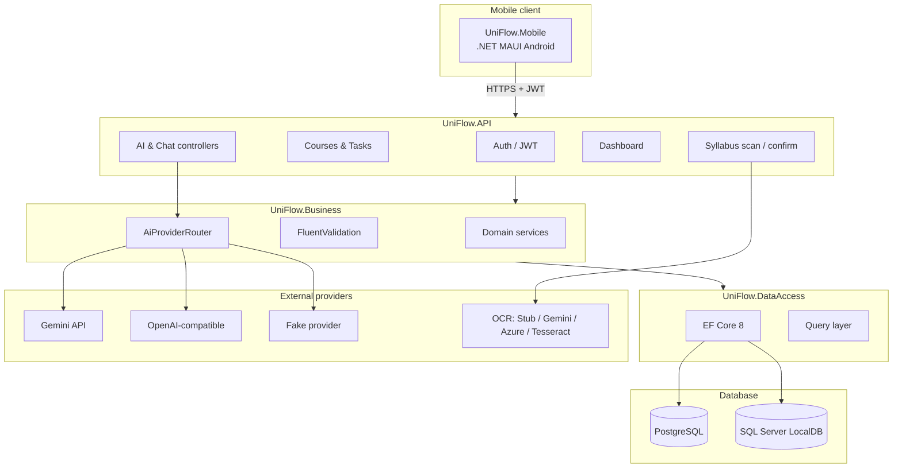

# UniFlow Architecture

High-level view of the UniFlow / AppPreneur stack: .NET MAUI mobile client, ASP.NET Core API, layered backend, and pluggable AI/OCR providers.

## System diagram

## Layer responsibilities

| Layer | Project | Responsibility |
| --- | --- | --- |
| API | `UniFlow.API` | HTTP endpoints, JWT auth, rate limiting, health checks, Swagger |
| Business | `UniFlow.Business` | Domain logic, AI orchestration, OCR, validation, prompts |
| Data | `UniFlow.DataAccess` | EF Core DbContext, repositories, queries, migrations |
| Entity | `UniFlow.Entity` | Persistence models, enums, `Result<T>` types, read models |
| Mobile | `UniFlow.Mobile` | MAUI UI, MVVM, `ApiClient`, secure token storage |

## Key flows

### Syllabus ingestion

1. Mobile uploads multipart form → `POST /api/v1/syllabus/scan`
2. File validation → OCR → AI/heuristic parse → preview session (user-bound)
3. User edits selection → `POST /api/v1/syllabus/confirm`
4. Transaction creates or reuses course, syllabus, and task items

### AI products

1. Controller resolves `userId` from JWT
2. Business service loads user-scoped data (courses, tasks, profile)
3. `AiProviderRouter` selects Gemini, OpenAI-compatible, or Fake provider
4. Response parsed with JSON extractors and fallback builders where applicable

## Related docs

- [Root README](../README.md)
- [Backend README](../src/backend/README.md)
